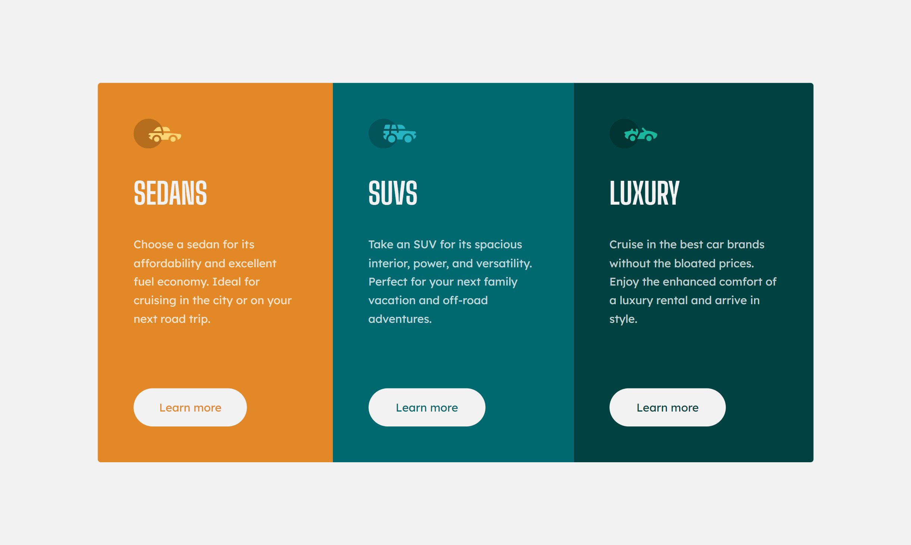

# Frontend Mentor - 3-column preview card component solution

This is a solution to the [3-column preview card component challenge on Frontend Mentor](https://www.frontendmentor.io/challenges/3column-preview-card-component-pH92eAR2-). Frontend Mentor challenges help you improve your coding skills by building realistic projects.

## Overview

FrontEnd Mentor Website Challenge

### Screenshot



### Links

- Solution URL: [Solution](https://www.frontendmentor.io/solutions/responsive-3-column-card-using-css-flexbox-V-geCUQx5Y)
- Live Site URL: [DEMO Version](https://3-column-preview-card-component-itsteatv.vercel.app/)

### Built with

- Semantic HTML5 markup
- CSS custom properties
- Flexbox
- [React](https://reactjs.org/) - JS library
- [Vite](https://vitejs.dev/) - Development Server

## 🖥️ Run Locally

1️⃣ Clone the project

```bash
  git clone https://github.com/itsteatv/3-column-preview-card-component.git
```

2️⃣ Go to the project directory

```bash
  cd 3-column-preview-card-component📝
```

3️⃣ Install dependencies

```bash
  npm install
```

🔚 Start the server

```bash
  npm run dev
```

### What I learned

This challenge was so fun and not really difficult,
This kind of practices and challenges can really improve your CSS skills especially FlexBox

## Author

- Website - [itsteatv](https://itsteatv-socialmedia.vercel.app/)
- Frontend Mentor - [@itsteatv](https://www.frontendmentor.io/profile/itsteatv)
- Twitter - [@itsteatv](https://twitter.com/itsteatv)

## Acknowledgments

If you have any idea to make the code better and more human-readable
provide your idea on <a href="https://www.frontendmentor.io/solutions/responsive-3-column-card-using-css-flexbox-V-geCUQx5Y">here</a>
