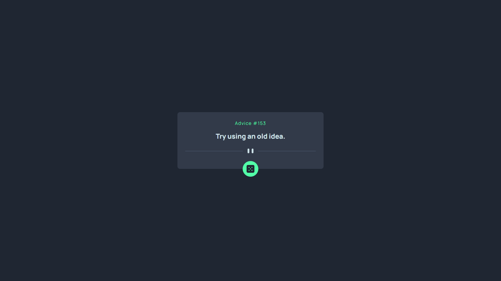

# Advice App
***Your go-to platform for thoughtful advice, built with ReactJS, TypeScript, and React Query v5***

**Welcome to Advice App!**

Advice App is a mini app for showing random advices from api. This advice app is Built with the latest web technologies, including ReactJS, TypeScript, and React Query v5. Here's what sets Advice App apart:

**Cutting-Edge Front-End with ReactJS and TypeScript:** Our front-end is developed using ReactJS, a powerful JavaScript library, and TypeScript, a superset of JavaScript that adds static typing. This combination ensures a robust and scalable codebase, making development more efficient and reliable.

**Efficient State Management with React Query v5:** The application leverages React Query v5 for state management, offering efficient data fetching, caching, and real-time updates. With React Query v5, we provide a smooth and dynamic experience, ensuring that users have the latest advice at their fingertips.

**User-Friendly Interface with Tailwind CSS:** The user interface is crafted using Tailwind CSS, providing a visually appealing and responsive layout. Tailwind CSS makes it easy to create a modern and sleek design, enhancing the overall user experience.

# Live Demo
[Advice App Demo](https://advice-generator-itsteatv.vercel.app/)

# Live Demo


# Technologies Used:

**1. ReactJS:**

-   The front-end is built using ReactJS, providing a powerful and interactive user interface.

**2. TypeScript:**

-   TypeScript is used to add static typing to JavaScript, enhancing code quality and development productivity.

**3. React Query v5:**

-   React Query v5 is employed for efficient state management, data fetching, and real-time updates, ensuring a smooth user experience.

**4. Tailwind CSS:**

-   Tailwind CSS is responsible for the visually appealing design and responsive layout of the user interface.

# Getting Started

## Prerequisites

Ensure you have Node.js and npm installed on your machine.

## Installation

To run the project locally, follow these steps:

1. Clone the repository:

    ```bash
    git clone https://github.com/itsteatv/mini-projects.git
    ```

2. Navigate to the project directory:

    ```bash
    cd advice-app
    ```

3. Install dependencies:

    ```bash
    npm install
    ```

4. Start the development server:

    ```bash
    npm start
    ```

# Contributing

Contributions are welcome! If you find any issues or have suggestions for improvement, please feel free to submit a pull request. Help us make AdviceHub even better!